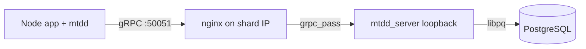

# mtdd_server

Shard-side gRPC server for [@advcomm/mtdd](https://github.com/advcomm/mtdd). Each instance runs on a database host behind nginx, accepts `Connect` / `QueryStream` / `Disconnect`, executes SQL on **local PostgreSQL** via libpq, and streams results as FlexBuffers metadata plus Apache Arrow IPC.

The same process also exposes **`MtddNotify`**, a coordinator-style LISTEN/NOTIFY transport matching the client’s `mtdd-notify-transport.js` (see client commit [e131cf8](https://github.com/advcomm/mtdd/commit/e131cf86c7c322bd28516f494e7a91c95a702902)).

## Requirements

- C++17 compiler
- CMake 3.20+
- gRPC, Protobuf, libpq, Apache Arrow, FlatBuffers

On Ubuntu 24.04:

```bash
sudo apt-get install -y build-essential cmake pkg-config \
  protobuf-compiler protobuf-compiler-grpc libgrpc++-dev libprotobuf-dev \
  libpq-dev libarrow-dev libflatbuffers-dev libgtest-dev
```

Or use [vcpkg](https://vcpkg.io) with the included `vcpkg.json`:

```bash
cmake -B build -DCMAKE_TOOLCHAIN_FILE=$VCPKG_ROOT/scripts/buildsystems/vcpkg.cmake
cmake --build build -j
```

## Build

```bash
cmake -B build -DCMAKE_BUILD_TYPE=Release
cmake --build build -j
ctest --test-dir build --output-on-failure
```

Binary: `build/mtdd_server`

## Configuration

| Variable | Default | Description |
|----------|---------|-------------|
| `MTDD_LISTEN` | `127.0.0.1:50051` | gRPC bind address |
| `MTDD_HOST_INDEX` | _(unset)_ | Required in production; must match client `Connect.host_index` |
| `MTDD_PG_HOST` | `127.0.0.1` | libpq host (local Postgres) |
| `MTDD_POOL_SIZE` | `8` | Pool size for non-session queries |
| `MTDD_ARROW_BATCH_ROWS` | `10000` | Max rows per Arrow IPC batch |
| `MTDD_PG_CONNECT_TIMEOUT_SEC` | `5` | libpq connect timeout |
| `MTDD_MAX_SESSIONS` | `512` | Pinned `session_id` connections |
| `MTDD_GRPC_MAX_THREADS` | CPU count | gRPC sync server threads |

Database credentials are supplied by the client in `Connect` (from app `DB_NAME`, `DB_USER`, `DB_PASSWORD`, `DB_PORT`).

## Client setup

Production apps must use Arrow streaming:

```bash
export MTDD_GRPC_RESULT_FORMAT=arrow
export MTDD_GRPC_PORT=50051
export DB_HOST='["10.0.1.10","10.0.1.11"]'
node --require @advcomm/mtdd/register app.js
```

Unary JSON `Query` was removed from the proto; use `QueryStream` with `MTDD_GRPC_RESULT_FORMAT=arrow`.

## LISTEN / NOTIFY

`LISTEN`, `UNLISTEN`, and `NOTIFY` SQL is handled **client-side** — it never goes through `QueryStream`. When the client is configured with a notify coordinator URL, it uses the **`MtddNotify`** gRPC service instead:

| RPC | Purpose |
|-----|---------|
| `Subscribe` | Register `client_id` on `channel` + `tid_scope` |
| `Unsubscribe` | Remove one channel subscription |
| `UnsubscribeAll` | Clear all subscriptions for `client_id` |
| `Publish` | Fan out `{ channel, payload, process_id }` to subscribers |
| `Watch` | Server stream of notifications for `client_id` |

Channel keys use `${tid_scope}:${channel}` where `tid_scope` is `__global__` or a tenant id (matches `resolveTidScope` on the client). `process_id` is `0` until real backend pids are wired.

`MtddNotify` is registered on the **same gRPC port** as `MtddShard` (`MTDD_LISTEN`). Point the client at this endpoint when `MTDD_NOTIFY_URL` gRPC transport is enabled in `@advcomm/mtdd`.

## Deployment

1. Run PostgreSQL on localhost on each shard VM.
2. Run `mtdd_server` bound to loopback (`MTDD_LISTEN=127.0.0.1:50051`).
3. Configure nginx HTTP/2 gRPC proxy on the host IP — see [deploy/nginx/mtdd-grpc.conf](deploy/nginx/mtdd-grpc.conf).
4. Set `MTDD_HOST_INDEX` to the shard’s index in `DB_HOST` — see [deploy/systemd/mtdd-server.service](deploy/systemd/mtdd-server.service).



## Proto sync

Keep [proto/mtdd.proto](proto/mtdd.proto) aligned with the client repo:

```bash
./scripts/sync-proto.sh
```

## Integration test (Docker)

```bash
docker compose up --build --abort-on-container-exit integration
```

This builds the server, starts Postgres, runs Connect → QueryStream → session transaction → Disconnect smoke tests, then Subscribe → Publish → Watch notify tests.

## Wire format

`QueryStream` chunk order: `SCHEMA` → `BATCH`* → `TRAILER`, or `ERROR` on failure. Column data is Arrow IPC; control metadata is FlexBuffers (same layout as the Node `result-meta-codec.js`).

## License

MIT — see [LICENSE](LICENSE).
