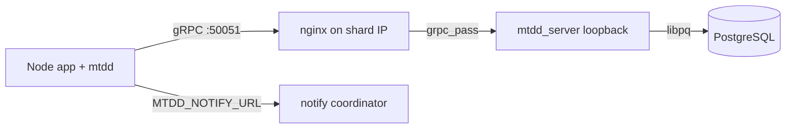

# mtdd_server

Shard-side gRPC server for [@advcomm/mtdd](https://github.com/advcomm/mtdd). Each instance runs on a database host behind nginx, accepts `Connect` / `QueryStream` / `Disconnect`, executes SQL on **local PostgreSQL** via libpq, and streams results as FlexBuffers metadata plus Apache Arrow IPC.

The same binary can expose **`MtddNotify`**, a coordinator-style LISTEN/NOTIFY transport matching the client’s `grpc-notify-client.js` (client commit [f37b2d9](https://github.com/advcomm/mtdd/commit/f37b2d95e93ba444e69e2cf2e62ec30047debf28)).

## Requirements

- C++17 compiler
- CMake 3.20+
- gRPC, Protobuf, libpq, Apache Arrow, FlatBuffers

On Ubuntu 24.04:

```bash
sudo apt-get install -y build-essential cmake pkg-config \
  protobuf-compiler protobuf-compiler-grpc libgrpc++-dev libprotobuf-dev \
  libpq-dev libarrow-dev libflatbuffers-dev libgtest-dev
```

Or use [vcpkg](https://vcpkg.io) with the included `vcpkg.json`:

```bash
cmake -B build -DCMAKE_TOOLCHAIN_FILE=$VCPKG_ROOT/scripts/buildsystems/vcpkg.cmake
cmake --build build -j
```

## Build

```bash
cmake -B build -DCMAKE_BUILD_TYPE=Release
cmake --build build -j
ctest --test-dir build --output-on-failure
```

Binary: `build/mtdd_server`

## Configuration

| Variable | Default | Description |
|----------|---------|-------------|
| `MTDD_LISTEN` | `127.0.0.1:50051` | gRPC bind address |
| `MTDD_ENV` | _(unset)_ | Set to `production` to enforce host index and loopback bind |
| `MTDD_HOST_INDEX` | _(unset)_ | Required when `MTDD_ENV=production`; must match client `Connect.host_index` |
| `MTDD_PG_HOST` | `127.0.0.1` | libpq host (local Postgres) |
| `MTDD_POOL_SIZE` | `8` | Pool size for non-session queries |
| `MTDD_ARROW_BATCH_ROWS` | `10000` | Max rows per Arrow IPC batch |
| `MTDD_PG_CONNECT_TIMEOUT_SEC` | `5` | libpq connect timeout |
| `MTDD_MAX_SESSIONS` | `512` | Pinned `session_id` connections |
| `MTDD_GRPC_MAX_THREADS` | CPU count | gRPC sync server threads |
| `MTDD_NOTIFY_ENABLED` | `1` | Register `MtddNotify` (`0` on shard-only nodes) |
| `MTDD_GRPC_REFLECTION` | `0` in production | Proto reflection for debugging |
| `MTDD_STATEMENT_TIMEOUT_MS` | `0` | PostgreSQL `statement_timeout` (0 = disabled) |
| `MTDD_MAX_QUERY_TEXT_BYTES` | `1048576` | Max SQL text size |
| `MTDD_MAX_NOTIFY_PAYLOAD_BYTES` | `65535` | Max NOTIFY payload |
| `MTDD_MAX_NOTIFY_CHANNEL_BYTES` | `63` | Max channel name length |
| `MTDD_HEALTH_PROBE_INTERVAL_SEC` | `30` | Periodic PostgreSQL probe after first Connect |
| `MTDD_HEALTH_REQUIRE_PG` | `1` | Set `0` on notify-only coordinator nodes |
| `MTDD_ALLOW_PUBLIC_BIND` | `0` | Allow non-loopback bind in production |
| `MTDD_GRPC_TLS` | `0` | Enable native gRPC TLS on the server listener |
| `MTDD_GRPC_TLS_CERT_FILE` | _(unset)_ | Server certificate PEM path |
| `MTDD_GRPC_TLS_KEY_FILE` | _(unset)_ | Server private key PEM path |
| `MTDD_GRPC_TLS_CLIENT_CA_FILE` | _(unset)_ | Optional client CA for mTLS |

Database credentials are supplied by the client in `Connect` (from app `DB_NAME`, `DB_USER`, `DB_PASSWORD`, `DB_PORT`).

Pair server TLS with client [f37b2d9+ TLS env vars](https://github.com/advcomm/mtdd/commit/f37b2d95e93ba444e69e2cf2e62ec30047debf28) (`MTDD_GRPC_TLS_CA_FILE`, optional client cert). See [docs/OPERATIONS.md](docs/OPERATIONS.md).

### Production example

```bash
export MTDD_ENV=production
export MTDD_LISTEN=127.0.0.1:50051
export MTDD_HOST_INDEX=0
export MTDD_PG_HOST=127.0.0.1
export MTDD_NOTIFY_ENABLED=1
export MTDD_GRPC_REFLECTION=0
```

## Client setup

Production apps must use Arrow streaming:

```bash
export MTDD_GRPC_RESULT_FORMAT=arrow
export MTDD_GRPC_PORT=50051
export DB_HOST='["10.0.1.10","10.0.1.11"]'
# Multi-shard: point all apps at one notify coordinator
export MTDD_NOTIFY_URL=10.0.0.100:50051
node --require @advcomm/mtdd/register app.js
```

## LISTEN / NOTIFY

`LISTEN`, `UNLISTEN`, and `NOTIFY` SQL is handled **client-side** — it never goes through `QueryStream`. The client uses **`MtddNotify`** gRPC when not mocking:

| RPC | Purpose |
|-----|---------|
| `Subscribe` | Register `client_id` on `channel` + `tid_scope` |
| `Unsubscribe` | Remove one channel subscription |
| `UnsubscribeAll` | Clear all subscriptions for `client_id` |
| `Publish` | Fan out `{ channel, payload, process_id }` to subscribers |
| `Watch` | Server stream of notifications for `client_id` |

### Coordinator deployment

Notify subscriptions are stored **in process memory**. All subscribed clients must use the **same coordinator endpoint**:

- **Single shard:** client defaults to first `DB_HOST` write IP + `MTDD_GRPC_PORT` (no `MTDD_NOTIFY_URL` needed).
- **Multi-shard:** set `MTDD_NOTIFY_URL` on every app to one host. Run notify on that host only, or set `MTDD_NOTIFY_ENABLED=0` on other shards.

See [deploy/nginx/mtdd-notify-coordinator.conf](deploy/nginx/mtdd-notify-coordinator.conf) and [deploy/systemd/mtdd-notify-coordinator.service](deploy/systemd/mtdd-notify-coordinator.service).

After a notify `Watch` stream drops, the client reconnects and re-issues `Subscribe` for known channels. Subscriptions persist on the server until `Unsubscribe` / `UnsubscribeAll`.

### Disconnect semantics

`Disconnect` acknowledges client channel teardown only. It does **not** drain the shared connection pool or pinned sessions used by other app instances on the same shard.

## Deployment

1. Run PostgreSQL on localhost on each shard VM.
2. Run `mtdd_server` bound to loopback (`MTDD_LISTEN=127.0.0.1:50051`, `MTDD_ENV=production`).
3. Configure nginx HTTP/2 gRPC proxy on the host IP — see [deploy/nginx/mtdd-grpc.conf](deploy/nginx/mtdd-grpc.conf).
4. Set `MTDD_HOST_INDEX` to the shard’s index in `DB_HOST` — see [deploy/systemd/mtdd-server.service](deploy/systemd/mtdd-server.service).



### Health checks

gRPC health starts `NOT_SERVING` until the first successful `Connect` probes PostgreSQL. Use `grpc.health.v1.Health/Check` for load balancers and orchestrators. Notify-only coordinators with `MTDD_HEALTH_REQUIRE_PG=0` report `SERVING` at startup.

## Proto sync

[proto/mtdd.proto](proto/mtdd.proto) is the **source of truth**. The client copies from this repo via its `scripts/sync-proto.sh`. Verify alignment with a client release:

```bash
./scripts/sync-proto.sh
# MTDD_PROTO_REF=f37b2d95e93ba444e69e2cf2e62ec30047debf28  (default)
```

CI runs this on every PR.

## Integration test (Docker)

```bash
docker compose up --build --abort-on-container-exit integration
```

Compose profiles:

```bash
# Notify-only coordinator (no Postgres health requirement)
docker compose --profile notify-coordinator up notify_coordinator

# Shard without MtddNotify
docker compose --profile shard-only up shard_only
```

## Wire format

`QueryStream` chunk order: `SCHEMA` → `BATCH`* → `TRAILER`, or `ERROR` on failure. Column data is Arrow IPC; control metadata is FlexBuffers (same layout as the Node `result-meta-codec.js`).

## License

MIT — see [LICENSE](LICENSE).
